<p align="center">
  <picture>
    <source media="(prefers-color-scheme: dark)" srcset="docs/logo-dark.svg" />
    
  </picture>
</p>

<h1 align="center">Levi's Bitmap Bananza</h1>

<p align="center">
  <b>Fotos rein, druckfertige Schwarz-Weiß-Grafik raus.</b><br />
  Dithering, Halftone, Xerox-Dreck und Shirt-Kanten, direkt im Browser.
</p>

<p align="center">
  <a href="https://lbbstudio.pages.dev/"></a>
</p>

<p align="center">
  
  
  
  
  
  
</p>

<p align="center">
  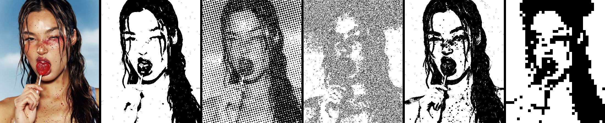
</p>

<p align="center">
  <a href="#was-es-kann">Was es kann</a> ·
  <a href="#beispiele">Beispiele</a> ·
  <a href="#oberfläche">Oberfläche</a> ·
  <a href="#lokal-starten">Lokal starten</a> ·
  <a href="#tastenkürzel">Tastenkürzel</a>
</p>

## Was es kann

- **Acht Looks** mit einem Klick: Clean Photo, Hard Poster, Detail Ink, Newspaper, Dirty Xerox, Shirt Print, Logo Cleanup und Pixel Bitmap
- **Dithering, Halftone, Glyphen und Xerox-Dreck**, jeder Regler fein einstellbar
- **Shirt-Kanten**: weiche oder raue Ränder, Weiß transparent, Druck-Check mit Farbdeckung und kleinster Insel
- **Zuschneiden, Radierer, Vorher/Nachher-Split** und Varianten-Vergleich
- **Export** als PNG, SVG oder ZIP-Paket (transparent, auf Schwarz, auf Weiß, Druckbericht), auch als Stapel
- Läuft komplett im Browser, kein Bild verlässt das Gerät

## Beispiele

Ein Foto, acht Looks. Jeder Look ist nur ein Startpunkt, danach lässt sich jeder Regler weiter verstellen.

<table>
  <tr>
    <td align="center">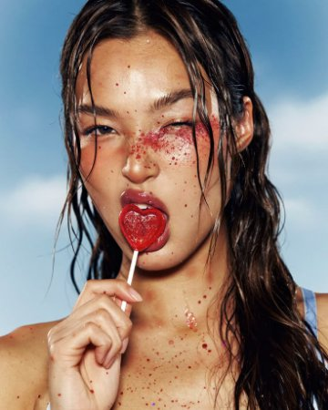<br /><b>Original</b><br /><sub>Das Foto</sub></td>
    <td align="center">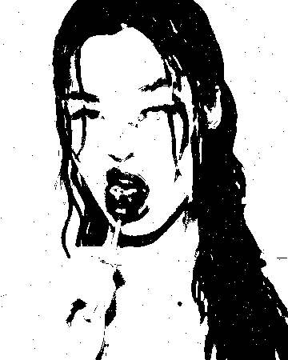<br /><b>Clean Photo</b><br /><sub>Foto, sauber getrennt</sub></td>
    <td align="center">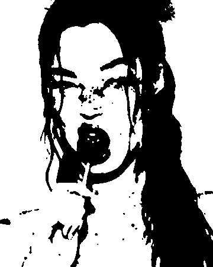<br /><b>Hard Poster</b><br /><sub>Große Flächen</sub></td>
  </tr>
  <tr>
    <td align="center">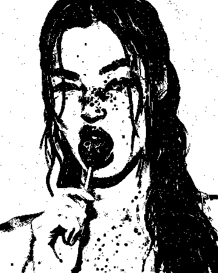<br /><b>Detail Ink</b><br /><sub>Kanten und Feinheiten</sub></td>
    <td align="center">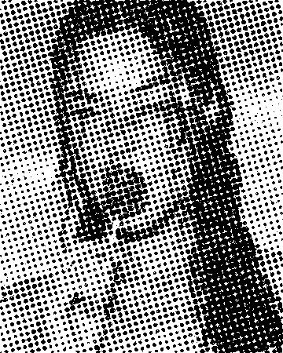<br /><b>Newspaper</b><br /><sub>Feines Punktraster</sub></td>
    <td align="center">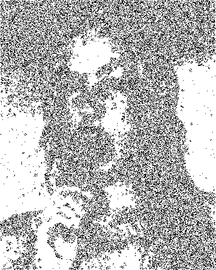<br /><b>Dirty Xerox</b><br /><sub>Kopierer-Dreck</sub></td>
  </tr>
  <tr>
    <td align="center">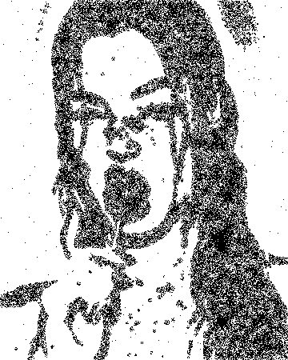<br /><b>Shirt Print</b><br /><sub>Transparent, weicher Rand</sub></td>
    <td align="center">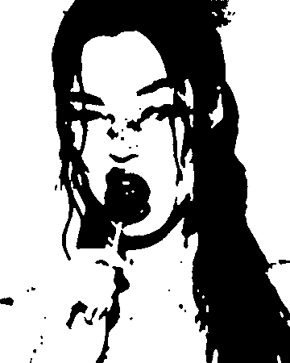<br /><b>Logo Cleanup</b><br /><sub>Scan zu klarer Fläche</sub></td>
    <td align="center">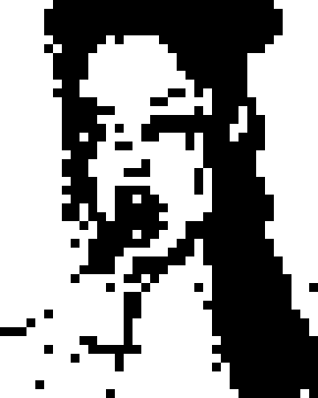<br /><b>Pixel Bitmap</b><br /><sub>Grobe Pixelblöcke</sub></td>
  </tr>
</table>

### Vorher und Nachher

<p align="center">
  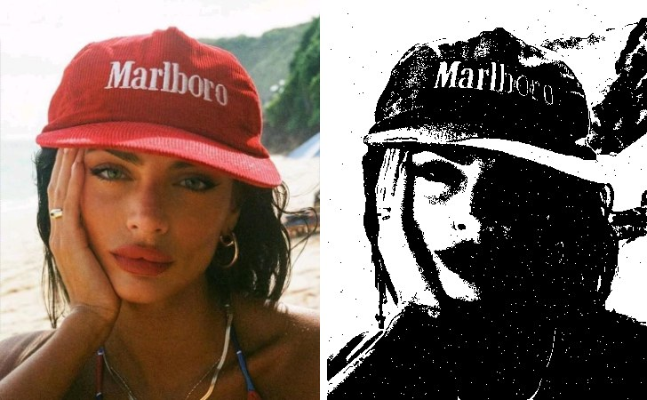
  &nbsp;
  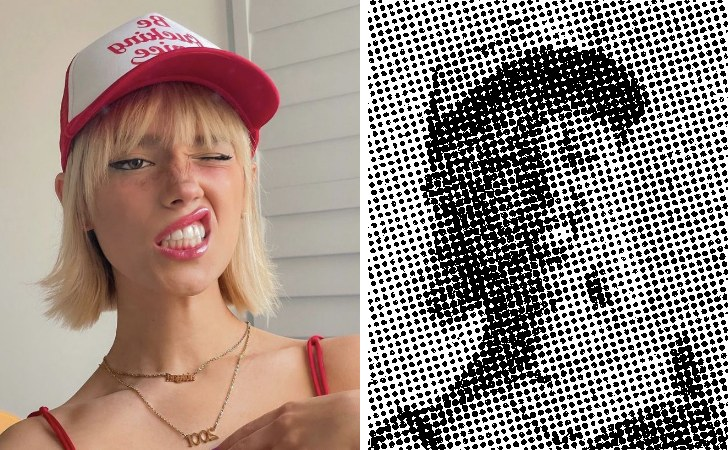
</p>
<p align="center"><sub>Links Detail Ink, rechts Newspaper. Alle Bilder sind direkt mit der Engine aus den Beispielfotos der App gerendert.</sub></p>

## Oberfläche

<p align="center">
  
</p>

<p align="center">
  
  &nbsp;
  
</p>

## Lokal starten

Voraussetzung ist Node 22 (siehe `.nvmrc`).

```sh
npm install
npm run dev            # http://localhost:5173
```

| Befehl                 | Was passiert                                 |
| ---------------------- | -------------------------------------------- |
| `npm run dev`          | Entwicklungsserver mit Hot Reload            |
| `npm run build`        | Typecheck und Produktions-Build nach `dist/` |
| `npm run preview`      | Den Build aus `dist/` lokal ausliefern       |
| `npm run typecheck`    | Nur TypeScript prüfen                        |
| `npm run format`       | Code mit Prettier formatieren                |
| `npm run format:check` | Prüfen, ob alles formatiert ist              |

## Aufbau

```
src/
  engine/        Bild-Engine, unverändert aus dem ursprünglichen Ein-Datei-Tool übernommen
    core.js      Pixel-Algorithmen
    index.js     öffentliche API: renderGraphic, renderAtSize, Analyse, SVG
    worker.js    rendert Vorschauen abseits des Haupt-Threads
  lib/           Regler-Schema, Export, Dateien laden, gemeinsame Aktionen
  state/         Zustand-Store (Regler, Verlauf, Ansicht, Werkzeuge), Renderer, Tastenkürzel
  components/    Oberfläche: Looks, Regler, Bühne, Dock, Zuschnitt, Suche, Vergleich, Export
public/          Favicon und Beispielbilder
docs/            Logo, Screenshots und Beispielbilder für diese README
```

Jeder Regler ist genau einmal in `src/lib/controls.ts` definiert. Schieberegler, Suche, die „geändert“-Punkte und Zurücksetzen lesen alle von dort, ein neuer Regler braucht also nur einen Eintrag.

Die Engine liefert für alle acht Looks pixelgleiche Ergebnisse zum Original-Tool, im Worker wie im Haupt-Thread. Pixel Bitmap rendert immer im Haupt-Thread, weil OffscreenCanvas minimal anders herunterskaliert.

## Tastenkürzel

| Tasten                 | Aktion                                         |
| ---------------------- | ---------------------------------------------- |
| Strg/⌘ K               | Regler oder Aktion suchen                      |
| Strg/⌘ O               | Bild öffnen                                    |
| Strg/⌘ S               | PNG exportieren                                |
| Strg/⌘ Z, Strg/⌘ ⇧ Z   | Rückgängig, Wiederholen                        |
| B (halten)             | Original zeigen                                |
| S                      | Vorher/Nachher teilen                          |
| F, 1, + / −            | Einpassen, 100 %, Zoom                         |
| C, E, M                | Zuschneiden (Enter übernimmt), Radierer, Maske |
| ?                      | Alle Tastenkürzel                              |
| Doppelklick auf Regler | Regler zurücksetzen                            |

## Deployment

Die Seite läuft auf Cloudflare Pages (Projekt `lbbstudio`). Jeder Push auf `main` wird automatisch gebaut.

- Build-Befehl: `npm run build`
- Ausgabeordner: `dist` (steht auch in `wrangler.toml`)

Gebaut mit React, Vite, Tailwind CSS, Motion und Zustand.
