<p align="center">
  <picture>
    <source media="(prefers-color-scheme: dark)" srcset="docs/logo-dark.svg" />
    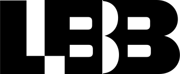
  </picture>
</p>

<h1 align="center">Levi's Bitmap Bananza</h1>

<p align="center">
  <b>Photo in, print-ready black &amp; white graphic out.</b><br />
  Dithering, halftone, xerox grit and shirt-ready edges, right in your browser.
</p>

<p align="center">
  <a href="https://lbbstudio.pages.dev/"></a>
</p>

<p align="center">
  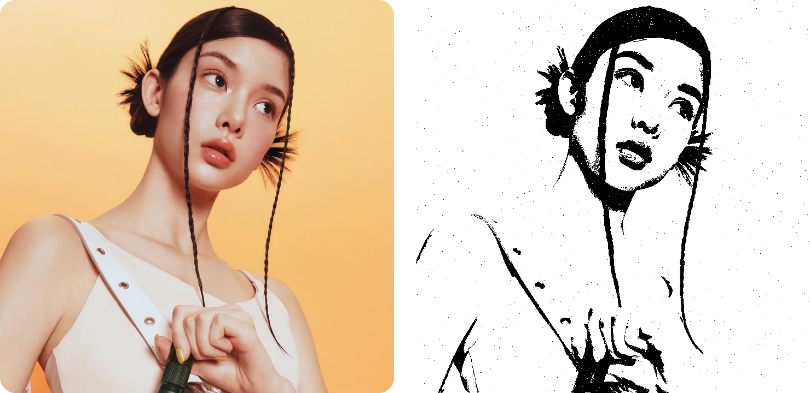
</p>

<p align="center">
  <a href="#what-it-does">What it does</a> ·
  <a href="#examples">Examples</a> ·
  <a href="#every-option">Every option</a> ·
  <a href="#export-and-upscaling">Export &amp; upscaling</a> ·
  <a href="#run-it-locally">Run it locally</a> ·
  <a href="#keyboard-shortcuts">Shortcuts</a>
</p>

## What it does

Bitmap Bananza turns any photo into a pure black and white graphic that is ready for screen printing, stickers, posters, zines or shirts. Pick a look with one click, then fine-tune it with more than 40 controls, 26 dither algorithms and 16 halftone shapes. Nothing is uploaded: every pixel is processed on your own device.

- **8 one-click looks** that set every control at once, from clean photo cut-outs to dirty photocopier grit
- **4 ways to draw grey tones:** solid areas, dithering, halftone screens or chunky pixels
- **26 dither algorithms**, from Floyd-Steinberg and Atkinson to Bayer, blue noise, maze and worm textures
- **16 halftone shapes** with size, angle, dot gain and jitter: round, newspaper, lines, waves, rings, stars and more
- **Print wear effects:** rough edges, ink bleed, dust and missing spots, grain
- **Edge fades for shirts:** soft, torn, crumbled, burned or grunge frame, with one-click presets
- **Cleanup tools for logos and scans:** remove specks, fill holes, thicken or thin lines, smooth jagged stairs
- **Upscaled export** up to 8000 px wide, re-rendered at full size so edges stay sharp
- **PNG, SVG and ZIP export**, plus batch export for many photos at once
- **Built-in print check:** print size at 300 DPI, ink coverage, smallest island in mm, edge contact, black/white only
- **Crop, eraser and mask preview**, undo and redo for every change
- **Compare variants** side by side and **save your own looks**
- **Search every control** with <kbd>Ctrl</kbd>/<kbd>⌘</kbd> <kbd>K</kbd>
- **Works on desktop and phone**, with pinch zoom on touch screens

## Examples

### Eight looks, one click each

Each look sets every control at once and works as a starting point. The small picture in the corner is the photo that went in.

<table>
  <tr>
    <td align="center">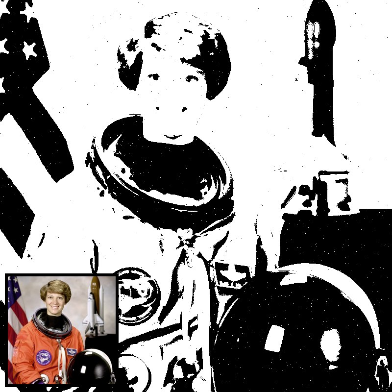<br /><b>Clean Photo</b><br /><sub>Photo, cleanly separated</sub></td>
    <td align="center">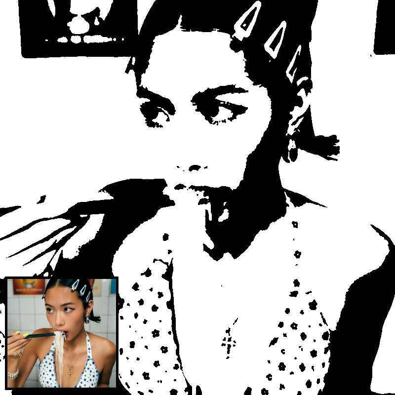<br /><b>Hard Poster</b><br /><sub>Big bold areas</sub></td>
  </tr>
  <tr>
    <td align="center">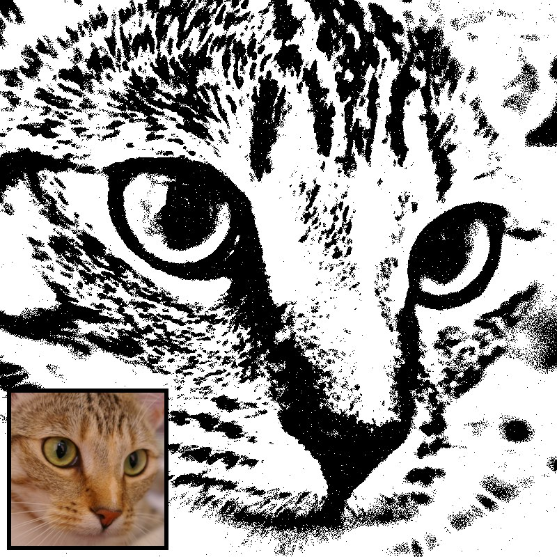<br /><b>Detail Ink</b><br /><sub>Every strand of hair</sub></td>
    <td align="center">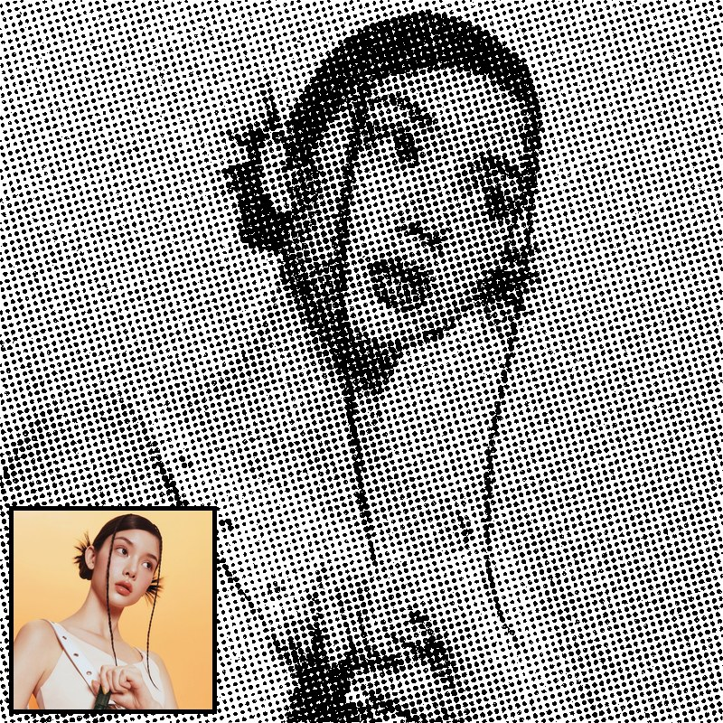<br /><b>Newspaper</b><br /><sub>Fine dot screen</sub></td>
  </tr>
  <tr>
    <td align="center">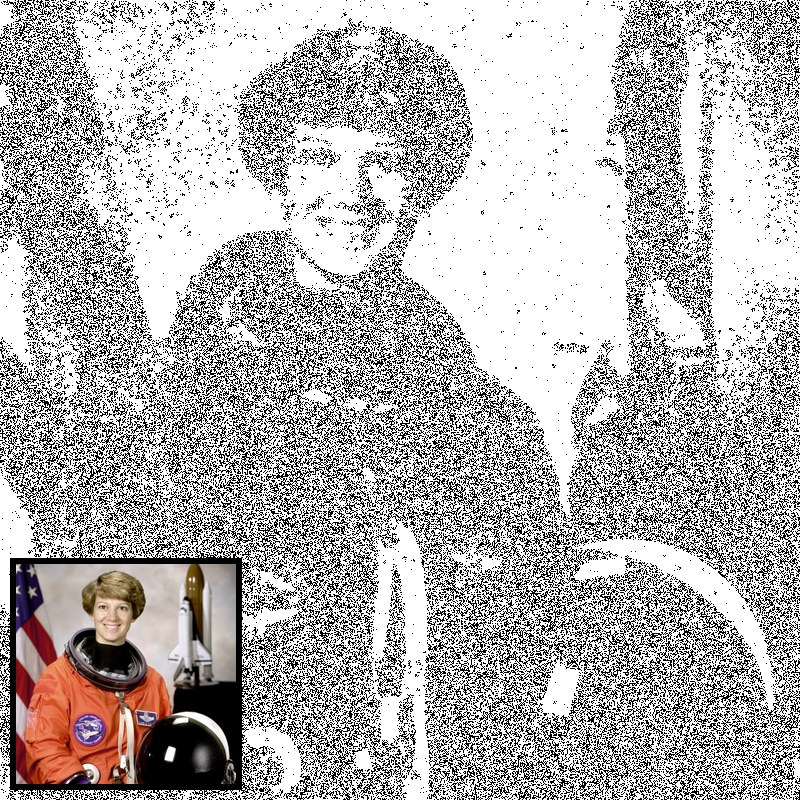<br /><b>Dirty Xerox</b><br /><sub>Photocopier grit</sub></td>
    <td align="center">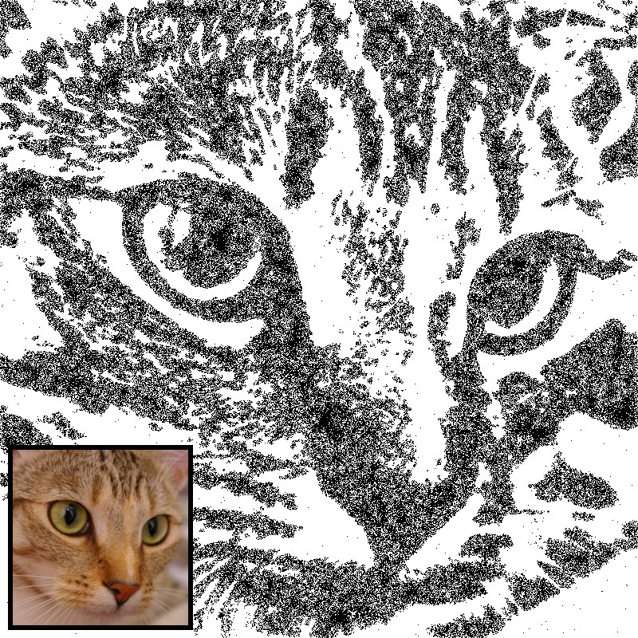<br /><b>Shirt Print</b><br /><sub>Textured ink for fabric</sub></td>
  </tr>
  <tr>
    <td align="center">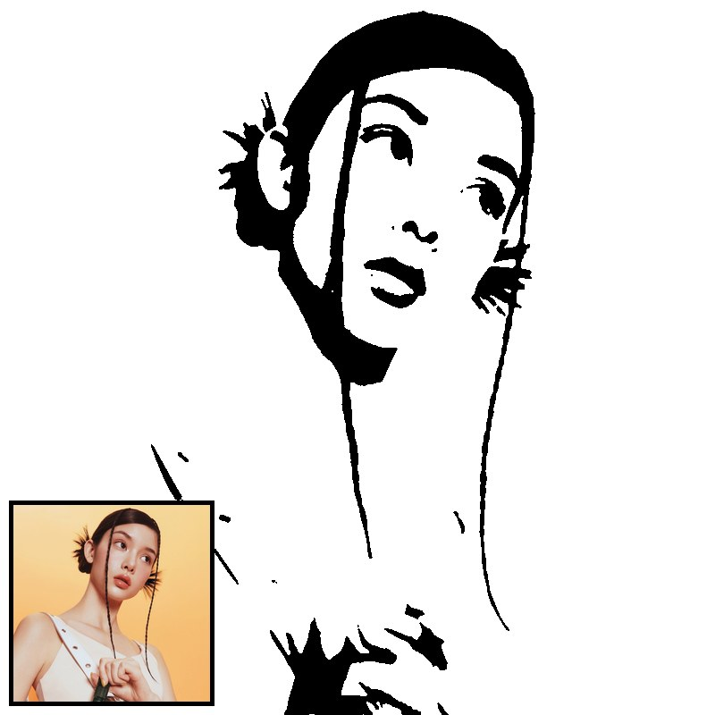<br /><b>Logo Cleanup</b><br /><sub>Clean solid shapes</sub></td>
    <td align="center">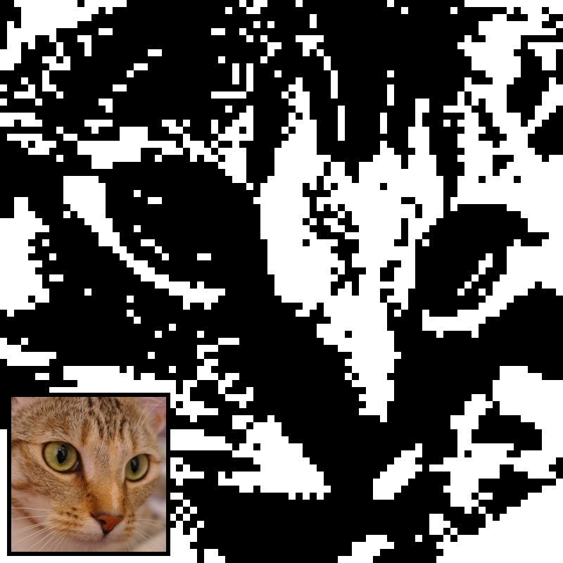<br /><b>Pixel Bitmap</b><br /><sub>Chunky pixel blocks</sub></td>
  </tr>
</table>

### One photo, endless ways to draw grey

The same portrait through five of the 26 dither algorithms and four of the 16 halftone shapes. Every one of them has its own sliders on top.

<table>
  <tr>
    <td align="center">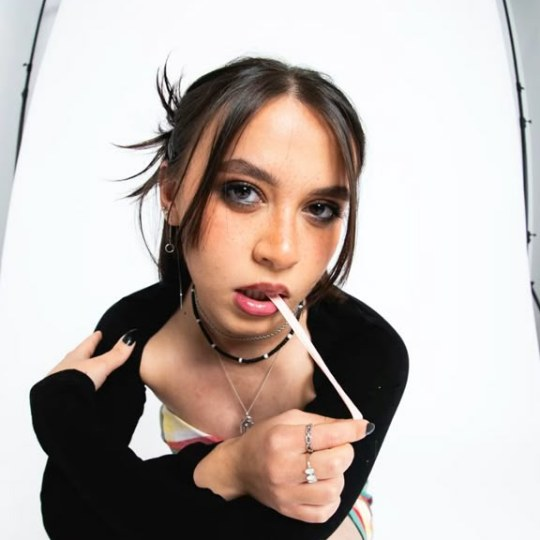<br /><b>Original</b><br /><sub>The photo</sub></td>
    <td align="center"><br /><b>Floyd-Steinberg</b><br /><sub>Error diffusion</sub></td>
    <td align="center">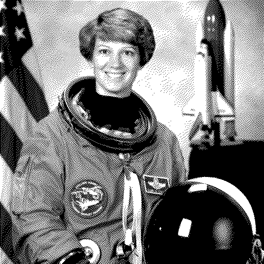<br /><b>Atkinson</b><br /><sub>Classic Mac look</sub></td>
  </tr>
  <tr>
    <td align="center">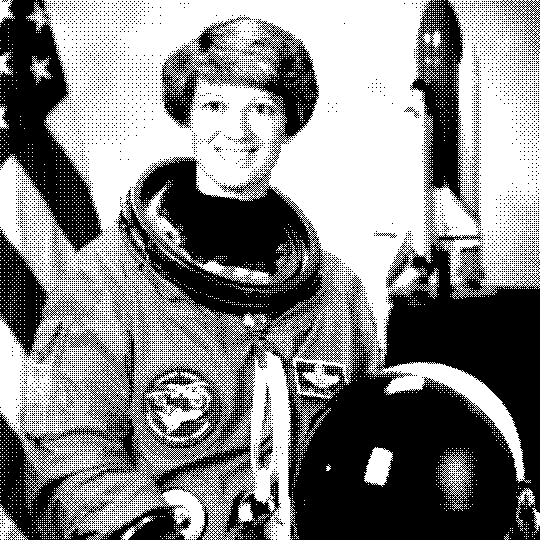<br /><b>Bayer 8×8</b><br /><sub>Ordered dither</sub></td>
    <td align="center"><br /><b>Blue Noise</b><br /><sub>Even speckle</sub></td>
    <td align="center">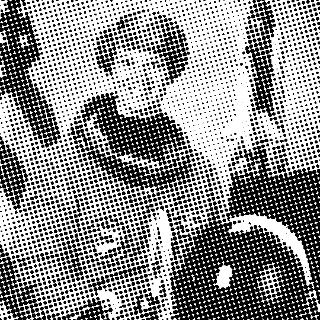<br /><b>Round Dots</b><br /><sub>Halftone screen</sub></td>
  </tr>
  <tr>
    <td align="center">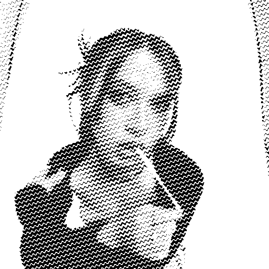<br /><b>Wave Lines</b><br /><sub>Halftone screen</sub></td>
    <td align="center">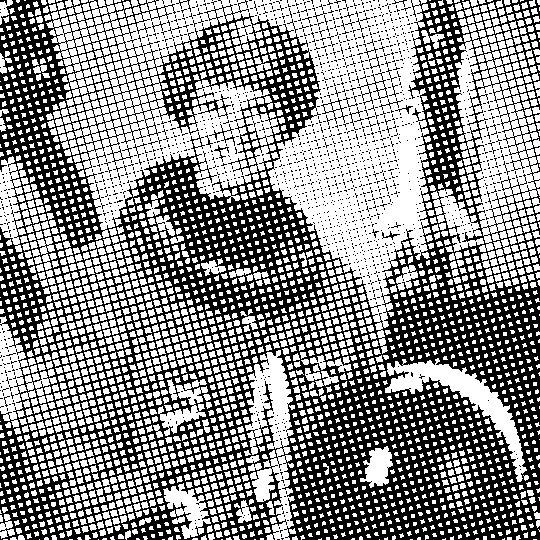<br /><b>Cross Hatch</b><br /><sub>Halftone screen</sub></td>
    <td align="center"><br /><b>Diagonal Lines</b><br /><sub>Halftone screen</sub></td>
  </tr>
</table>

### Made for print

Results shown in one ink on a shirt colour, the way they come off a screen print. Invert flips the artwork for white ink on dark fabric.

<table>
  <tr>
    <td align="center">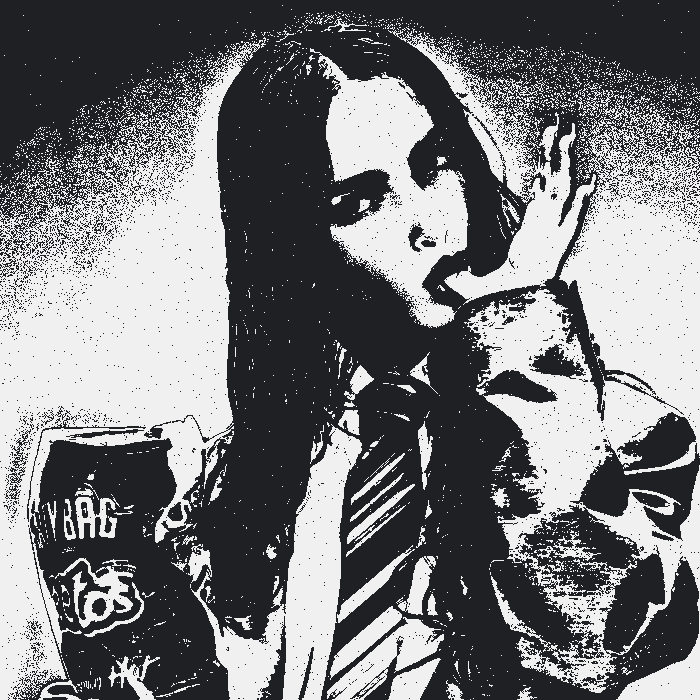<br /><b>White ink on charcoal</b><br /><sub>Detail Ink, inverted</sub></td>
    <td align="center">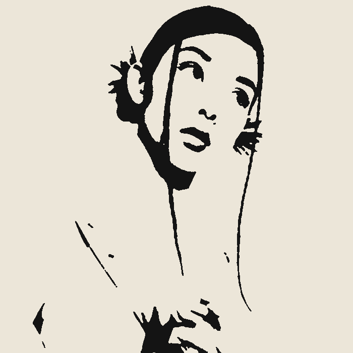<br /><b>Black ink on natural</b><br /><sub>Logo Cleanup</sub></td>
    <td align="center">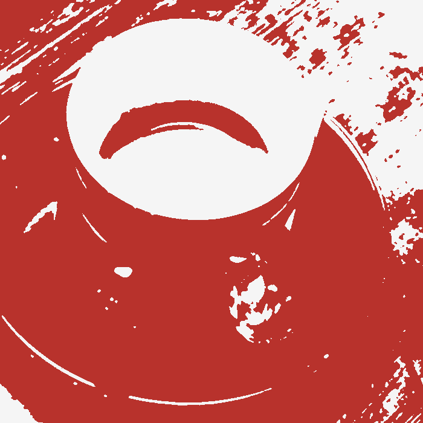<br /><b>White ink on red</b><br /><sub>Hard Poster</sub></td>
  </tr>
</table>

### Upscaling that stays sharp

Bitmap Bananza enlarges the photo first and only then converts it, so even a small source turns into crisp detail instead of blocky pixels.

<table>
  <tr>
    <td align="center">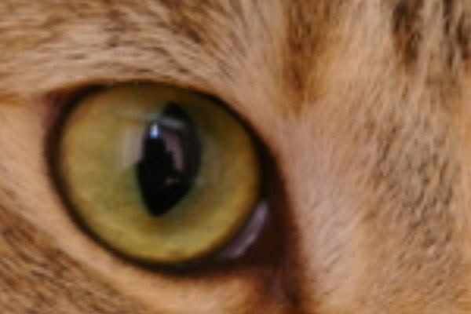<br /><b>Original</b><br /><sub>A tiny 150 × 100 px crop</sub></td>
    <td align="center">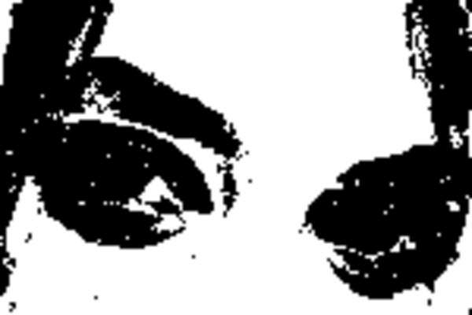<br /><b>Converted, then enlarged</b><br /><sub>Blocky and soft</sub></td>
    <td align="center">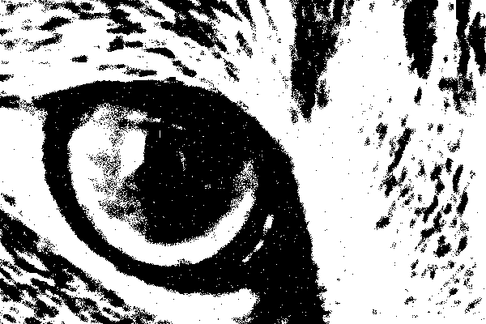<br /><b>Bitmap Bananza 4×</b><br /><sub>Re-rendered at full size</sub></td>
  </tr>
</table>

<sub>All examples are rendered with the app's own engine. Example photos are used with permission, all rights stay with their owners.</sub>

## Every option

The controls are grouped the way you usually work: overall tone first, then how grey is drawn, then wear, edges and cleanup. Controls that don't apply to the current mode are hidden, and a dot marks every control you changed. Double-click any slider to reset it.

<details>
<summary><b>Basics:</b> how much of the image turns black</summary>

| Control      | What it does                                         |
| ------------ | ---------------------------------------------------- |
| Threshold    | The grey level where pixels flip from white to black |
| Black amount | Pushes the whole image darker or lighter             |
| Contrast     | Separates light and dark before conversion           |
| Detail       | Keeps small features such as hair and freckles       |
| Smoothing    | Calms noisy areas into cleaner shapes                |

</details>

<details>
<summary><b>Structure:</b> solid, dither, halftone or pixel</summary>

Pick how grey tones are drawn: **Solid** (clean black and white areas), **Dither** (tones as dot patterns or noise), **Halftone** (print screens like newspapers and screen printing) or **Pixel** (chunky blocks with adjustable pixel size).

**26 dither algorithms**, with strength (0 to 250 %) and grain scale for the textured ones:

| Group           | Algorithms                                                                                               |
| --------------- | -------------------------------------------------------------------------------------------------------- |
| Clean           | Hard Threshold                                                                                           |
| Noisy           | Random Noise, Fine Salt Noise, Chunky Random Blocks, Blue Noise Speckle                                  |
| Organic         | Organic Noise, Organic Worm Texture, Maze Texture                                                        |
| Ordered         | Bayer 2×2, 4×4, 8×8, 16×16, Cluster Dot, Checker, Horizontal / Vertical / Diagonal Hatch, Scanline       |
| Error diffusion | Floyd-Steinberg, False Floyd, Atkinson, Sierra Lite, Sierra Two Row, Burkes, Stucki, Jarvis-Judice-Ninke |

**16 halftone shapes:** Round Dots, Tiny Newspaper Dots, Big Print Dots, Ellipse Dots, Line Screen, Vertical Lines, Diagonal Lines, Cross Hatch, Wave Lines, Square Dots, Diamond Dots, Ring Dots, Concentric Rings, Plus Marks, Brick Pattern, Star Dots. Each one comes with controls for screen size (3 to 50 px), angle (0 to 180°), dot gain (thicker or thinner dots), jitter and how strongly the screen is mixed in.

</details>

<details>
<summary><b>Print look:</b> wear like screen print or a photocopier</summary>

| Control                | What it does                            |
| ---------------------- | --------------------------------------- |
| Rough edges            | Frays the outlines of every shape       |
| Ink bleed              | Lets the ink spread like on cheap paper |
| Dust and missing spots | Adds specks and gaps like a worn screen |
| Grain                  | Adds an overall film grain              |

</details>

<details>
<summary><b>Edges and shirt:</b> fade out the image border, erase by hand</summary>

- **Edge fade:** off, soft fade, torn, crumbled, burned / photocopier, or grunge frame, each with width, strength and raggedness
- **Edge presets:** Soft, Torn and Heavy in one click
- **Eraser** with adjustable brush size (6 to 140 px) and a **mask preview** that shows exactly what was erased
- **Shirt ready** in one click: transparent background, torn edge and a 4096 px export

</details>

<details>
<summary><b>Cleanup:</b> specks, holes and line weight</summary>

Especially useful for logos and scans: remove small specks, fill holes, make lines thicker or thinner (up to 5 px each way) and smooth jagged stair-step edges.

</details>

<details>
<summary><b>Pro settings:</b> fine control over the conversion</summary>

| Control                                   | What it does                                                                                                       |
| ----------------------------------------- | ------------------------------------------------------------------------------------------------------------------ |
| Processing mode                           | Standard, Simple B/W, Clean Cutout, Photo Poster, High Detail Ink, Screenprint Halftone, Dirty Xerox, Pixel Bitmap |
| Threshold method                          | Fixed, automatic (Otsu), local per image area, or local with edges, plus local strength                            |
| Emphasize outlines                        | Draws edges in ink                                                                                                 |
| Sharpen / Pre-blur                        | Crisp up or soften the photo before conversion                                                                     |
| Tone curve                                | Gamma from 40 to 220                                                                                               |
| Midtones, shadow detail, highlight detail | Shape where the tones land                                                                                         |
| White cleanup                             | Clears grey haze from light areas                                                                                  |

</details>

<details>
<summary><b>Workspace</b></summary>

- **Before / after:** show the original, the result, or a draggable split view (hold <kbd>B</kbd> to peek at the original)
- **Zoom and pan** with mouse, trackpad or pinch, plus fit and 100 % buttons and a navigator overview
- **Crop** freely or to 1:1, 4:5, 3:4 or 2:3, and restore the original any time
- **Four workspace backgrounds:** cutting mat, navy, graphite or light grey, to judge your graphic on dark and light shirts
- **Preview quality:** fast (1100 px), balanced (1800 px) or close to export (2800 px). Export always renders at full size.
- **Look thumbnails** are rendered live from your own photo, so you see every look before you click it
- **Your own looks:** save the current settings as a named look and load or delete it later
- **Compare variants:** render 3, 4 or 6 variations (Balanced, Hard Poster, Detail Ink, Soft Halftone, Dirty Xerox, Shirt Ready) side by side and apply the one you like
- **Undo and redo** for every change, and sidebars you can resize by dragging

</details>

## Export and upscaling

| Option               | Result                                                                                         |
| -------------------- | ---------------------------------------------------------------------------------------------- |
| Current preview size | Fast export at the size you see                                                                |
| 2× and 4× larger     | Upscaled export, rendered fresh at the new size so edges and dots stay crisp instead of blurry |
| Original image size  | Full resolution of your photo                                                                  |
| Custom width         | Anything from 256 to 8000 px, with quick buttons for 2048, 3000 and 4096 px                    |

- **PNG** with white or transparent background, and an invert option for white-on-black prints
- **SVG** vector file for plotters, cutters and further editing
- **ZIP pack** with a transparent PNG, a version on black, a version on white, a print report and the settings as JSON
- **Batch export:** open several photos at once and every one gets the current look, delivered as one ZIP
- **Print check** before you export: resolution, print size at 300 DPI, transparency, black/white only, ink coverage, smallest island in mm and whether the motif touches the border, with tips when something looks risky for printing

<p align="center">
  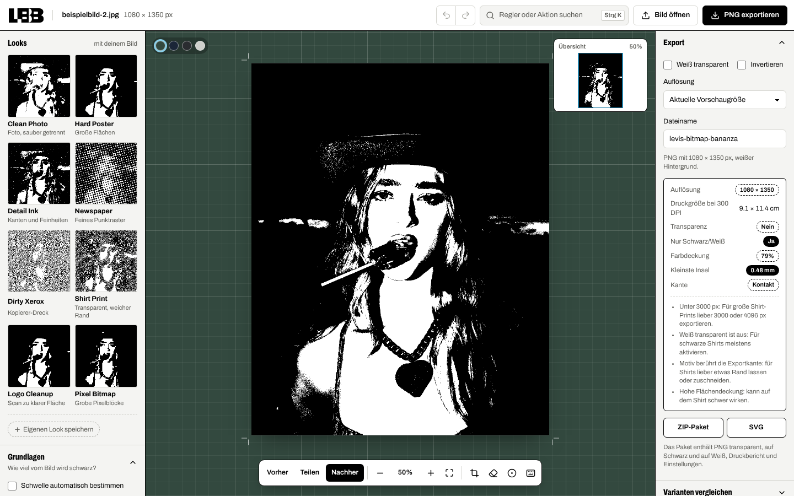
</p>

<p align="center">
  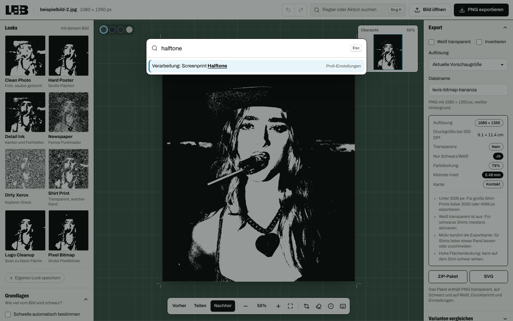
  &nbsp;
  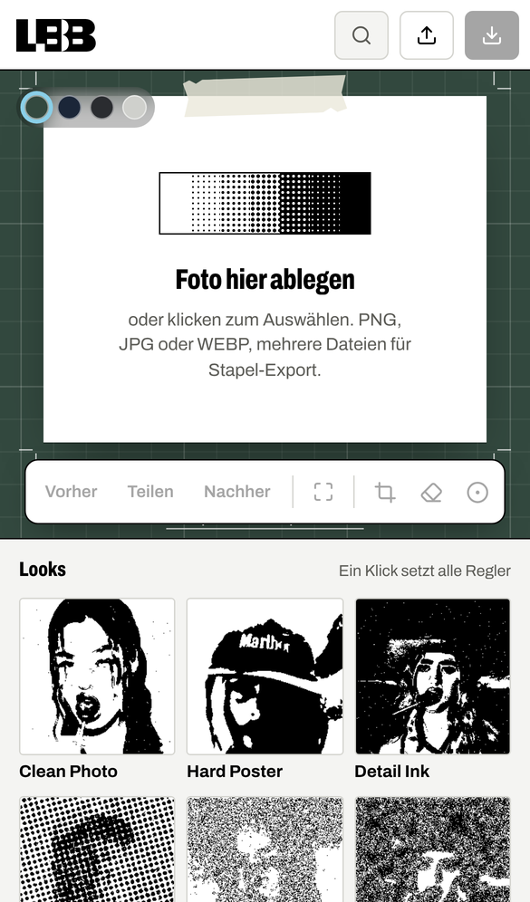
</p>

## Run it locally

<p>
  
  
  
  
  
  
</p>

You need Node 22 (see `.nvmrc`).

```sh
npm install
npm run dev            # http://localhost:5173
```

| Command                | What it does                                |
| ---------------------- | ------------------------------------------- |
| `npm run dev`          | Development server with hot reload          |
| `npm run build`        | Typecheck and production build into `dist/` |
| `npm run preview`      | Serve the build from `dist/` locally        |
| `npm run typecheck`    | Check TypeScript only                       |
| `npm run format`       | Format the code with Prettier               |
| `npm run format:check` | Check that everything is formatted          |

## Project structure

```
src/
  engine/        image engine, ported unchanged from the original single-file tool
    core.js      pixel algorithms
    index.js     public API: renderGraphic, renderAtSize, analysis, SVG
    worker.js    renders previews off the main thread
  lib/           control schema, export, file loading, shared actions
  state/         Zustand store (controls, history, view, tools), renderer, shortcuts
  components/    UI: looks, controls, stage, dock, crop, search, compare, export
public/          favicon and sample photos
docs/            logo, header image, screenshots and example images for this README
```

Every control is defined once in `src/lib/controls.ts`. Sliders, search, the "changed" dots and reset all read from there, so a new control only needs one entry.

The engine produces pixel-identical results to the original tool for all eight looks, both in the worker and on the main thread. Pixel Bitmap always renders on the main thread because OffscreenCanvas downsamples slightly differently.

## Keyboard shortcuts

| Keys                                                                  | Action                          |
| --------------------------------------------------------------------- | ------------------------------- |
| <kbd>Ctrl</kbd>/<kbd>⌘</kbd> <kbd>K</kbd>                             | Search any control or action    |
| <kbd>Ctrl</kbd>/<kbd>⌘</kbd> <kbd>O</kbd>                             | Open image                      |
| <kbd>Ctrl</kbd>/<kbd>⌘</kbd> <kbd>S</kbd>                             | Export PNG                      |
| <kbd>Ctrl</kbd>/<kbd>⌘</kbd> <kbd>Z</kbd> / <kbd>⇧</kbd> <kbd>Z</kbd> | Undo / redo                     |
| <kbd>B</kbd> (hold)                                                   | Show original                   |
| <kbd>S</kbd>                                                          | Split before / after            |
| <kbd>F</kbd>, <kbd>1</kbd>, <kbd>+</kbd> / <kbd>−</kbd>               | Fit, 100 %, zoom                |
| <kbd>C</kbd>                                                          | Crop (<kbd>Enter</kbd> applies) |
| <kbd>E</kbd>, <kbd>M</kbd>                                            | Eraser, mask preview            |
| <kbd>?</kbd>                                                          | All shortcuts                   |
| Double-click a slider                                                 | Reset it                        |

## Deployment

The site runs on Cloudflare Pages (project `lbbstudio`).

- Build command: `npm run build`
- Output directory: `dist` (also set in `wrangler.toml`)

Built with React, Vite, Tailwind CSS, Motion and Zustand.
